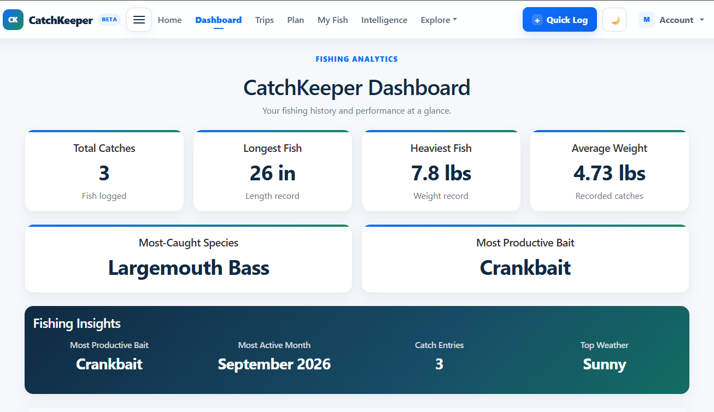
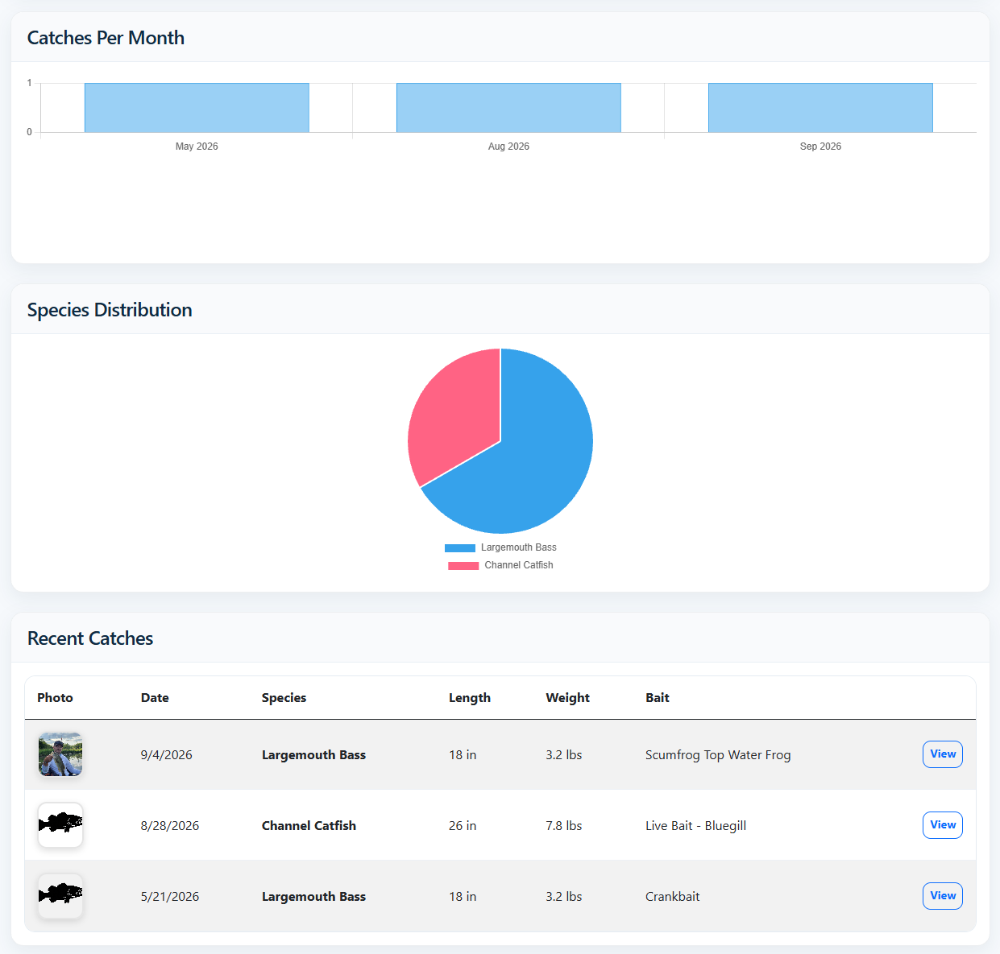
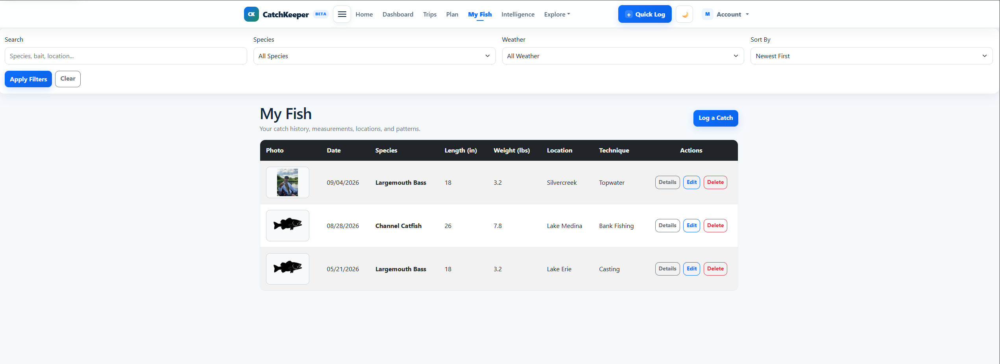
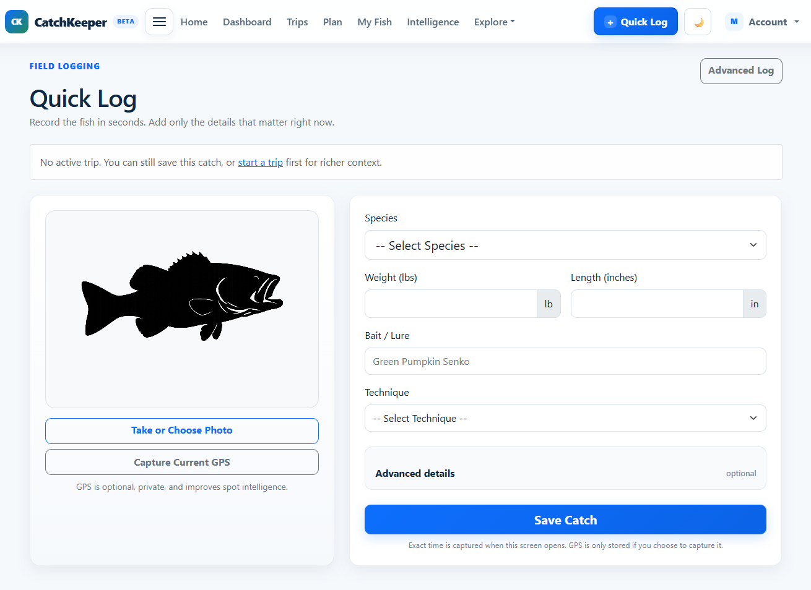

# CatchKeeper

CatchKeeper is a full-stack fishing analytics and catch-management platform built with ASP.NET Core MVC, C#, Entity Framework Core, and SQL Server.

The application takes a data-first approach to fishing. Anglers can record detailed catch and trip information—including species, bait, technique, weather, water conditions, and location—and use their historical data to identify patterns and generate personalized fishing insights.

## Project Status

**Active Development — Preparing for Production Release**

CatchKeeper is independently designed and developed by Branden Maxwell. The application source code is maintained in a private repository. This public repository provides a technical overview, feature documentation, screenshots, and development information for portfolio purposes.

## Technology Stack

**Backend**
- C#
- ASP.NET Core MVC
- Entity Framework Core
- ASP.NET Core Identity
- LINQ

**Database**
- SQL Server
- Entity Framework Core Migrations

**Frontend**
- Razor Views
- HTML
- CSS
- JavaScript
- Bootstrap

**Development**
- Visual Studio
- Git
- GitHub
- REST API development

## Core Features

### Catch Management

CatchKeeper allows anglers to record and manage detailed catch information including:

- Species
- Length and weight
- Bait
- Fishing technique
- Date and time
- Weather conditions
- Location
- Notes
- Photos

### Fishing Trips

Users can create and manage fishing trips with information including:

- Water body
- Trip date
- Start and end times
- Water temperature
- Water clarity
- Fishing spot
- Latitude and longitude
- Associated catches

### Fishing Analytics

CatchKeeper analyzes an angler's historical fishing data to provide personalized statistics and insights, including:

- Total catches
- Personal best records
- Average catch weight
- Most successful bait
- Most active fishing periods
- Productive weather conditions
- Catch-history statistics

### Authentication and Data Ownership

ASP.NET Core Identity provides account management and authentication.

Catch and trip data are associated with individual users, with authorization controls designed to protect user-specific information.

### Achievements

CatchKeeper includes an achievement system for tracking fishing milestones and accomplishments.

### Responsive Interface

The application provides a responsive interface designed for desktop and mobile-sized displays.

## Product Direction

CatchKeeper is designed as a fishing utility and analytics platform rather than a traditional social network.

The goal is to help anglers build a useful personal fishing dataset over time. Historical information can then be used to identify patterns involving:

- Productive bait
- Fishing techniques
- Locations
- Weather conditions
- Seasonal patterns
- Fishing times

Continued development is focused on expanding these analytics into increasingly personalized fishing recommendations.

## Architecture

CatchKeeper follows an ASP.NET Core MVC architecture with Entity Framework Core providing relational data access and ASP.NET Core Identity providing authentication and account functionality.

## Application Screenshots

### Dashboard Overview

The CatchKeeper dashboard provides an at-a-glance view of an angler's fishing activity, including catch statistics, personal records, and fishing insights.

### Fishing Analytics

CatchKeeper uses historical fishing data to surface patterns and statistics, helping anglers understand their fishing activity and identify productive trends over time.

### Fishing Trips

Fishing trips can be recorded separately from individual catches, allowing anglers to track water bodies, dates, conditions, locations, and catches associated with each trip.

### Catch History

Anglers can maintain a personal history of their catches with species, measurements, bait, technique, conditions, locations, photos, and other supporting information.

### Quick Log

Quick Log provides a streamlined workflow for recording catches while minimizing the amount of time required for data entry.

## Development Roadmap

Current development areas include:

- Production-readiness testing
- UI and usability refinement
- API/backend development
- Mobile application integration
- Subscription and premium-feature infrastructure
- Expanded fishing analytics and insights

An Android application is also being developed to integrate with the CatchKeeper backend architecture.

## Source Code

The active CatchKeeper source code is maintained in a **private repository**.

This public repository is intended to document the project's design, functionality, architecture, and development progress without distributing the production source code.

## Developer

**Branden Maxwell**  
Software Developer

C# | .NET | ASP.NET Core | SQL | Entity Framework Core | JavaScript

[GitHub Profile](https://github.com/Maxtheflash)

[LinkedIn](https://linkedin.com/in/brandenmaxwell)
